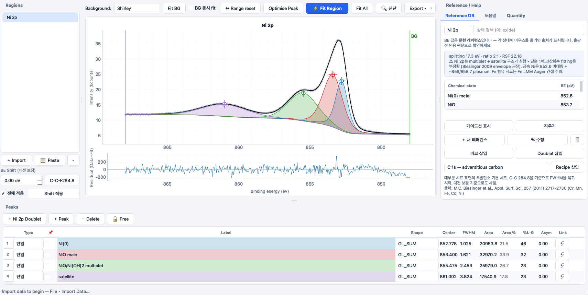

import { Card, CardGrid } from '@astrojs/starlight/components';

**Corepeak** reproduces the familiar XPSPEAK 4.1 workflow with a modern interface, then goes
further: it doesn't just let you fit X-ray photoelectron spectroscopy data — it **checks whether
your fit is physically and statistically defensible**, and it knows the literature binding
energies so you don't have to look them up.

<CardGrid stagger>
  <Card title="🔍 Built-in fit auditor" icon="approve-check">
    FWHM sanity, reference-DB binding-energy checks, doublet integrity, metallic-lineshape
    asymmetry, expected satellites, residual z-score, BIC, and a leave-one-out
    peak-necessity test that flags peaks the data doesn't actually require.
  </Card>
  <Card title="📚 Citation-backed database" icon="open-book">
    24 elements with binding energies, spin-orbit parameters and RSFs — every value carries its
    literature citation. One-click fitting recipes. Add your own references, kept across updates.
  </Card>
  <Card title="🖥️ Truly cross-platform" icon="laptop">
    Native macOS and Windows. No 5,000-point / 51-peak ceiling like XPSPEAK. No Python install,
    no account, free forever (GPLv3).
  </Card>
  <Card title="📥 Imports everything" icon="download">
    .dat / .txt / .csv / .xlsx / .xls, Thermo Avantage multi-sheet exports, VAMAS, or paste two
    columns straight from Excel/Origin. KE→BE conversion built in.
  </Card>
</CardGrid>

## The modern XPSPEAK replacement

| | Corepeak | XPSPEAK 4.1 | CasaXPS | KherveFitting / LG4X |
|---|---|---|---|---|
| Price | **Free (OSS)** | Free | €830+ | Free (OSS) |
| macOS native | ✅ | ❌ | ❌ | ✅ |
| Built-in fit auditor | ✅ | ❌ | ❌ | ❌ |
| Citation-backed reference DB | ✅ | ❌ | partial | ❌ |
| One-click recipes | ✅ | ❌ | ✅ | ❌ |
| Actively maintained | ✅ | ❌ (1999) | ✅ | ✅ |

[Download Corepeak →](/download/) · [See all features →](/features/) · [How it compares →](/compare/)
